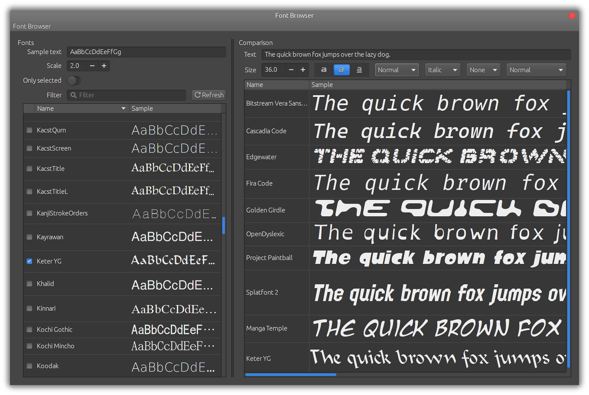

Font Browser - view and compare fonts
=========================================================

Have you ever felt the need to compare the same text, side-by-side, in different fonts, to
see which one looks better?

Font Browser does just that. It lists all installed fonts, and allows you to see a sample text
rendered with multiple fonts. Adjust size, styles, drag the rendered text up and down.

Requisites
----------

  - Python 3
  
  - GTK+ 3
  
  - gobject-introspection
  
  - Python bindings for GObject (usually in a package named python3-gobject or just
    python-gobject)

Building
--------

In a shell, run:

    ./configure
    make

If you obtained the source from the repository, first run the script `./bootstrap`, so it
can create the `configure` script.

The application `font-browser` can be run from the source directory, there's no need to
install it.

Installing
----------

To install, after building:

    sudo make install

See the file `INSTALL` for more details.
